## Introduction

Frank and Mike are day traders in XYZ Company. One day after the stock market closed, Frank felt extremely tired and was sick of all the time and work he needed to put into this job by just staring at multiple trading screens and performing routine trades. So he came up to Mike and said, "Wouldn't it be cool if we can find out the trend of NASDAQ 100 automatically and just do trades on that? We don't need to stare at the screens anymore!" Mike said, "You know what? That is an interesting idea. I know some students at Cornell might be able to do this. Let me talk to them and see if they can realize your idea." So here we are, helping these two lazy employees.

First of all, what NASDAQ 100 is? It is a stock market index that is made up of 100 non-financial companies' securities which are listed on NASDAQ. Generally, its trend represents the situation of U.S's economy. In order to predict its trend, we need to find data that might capture NASDAQ's movement, and build a model to optimize the accuracy.

## Data set description

### Summary

Our data set include daily data of Long Term Treasury Rate,	10 Year Treasury Bill Rate, USD/YEN, USD/RMB, USD/EUR, Oil Price, Gold Price, FTSE 100 Index, Nikkei 225 Index, S&P 500 Index, SSEC Index, VIX Index, Dow Jone Industrial Average, Russell 2000 Index, Hang Seng Index, Unemployment Google Trend Index, Mortgage Google Trend Index, Investing Google Trend Index, Bankrupcy Google Trend Index, NASDAQ Volume, and NASDAQ Index from 3/19/03 to 10/17/17.

### Reasons For Choosing These Data

1. Risk-free rate that represent the trend of macroeconomy: Long Term Treasury Rate,	10 Year Treasury Bill Rate
2. Exchange rates that represent international trade and its stability: USD/YEN, USD/RMB, USD/EUR
3. Commodity prices that represent industrial development and global risk measure: Oil Price, Gold Price
4. Different Indices that represent different countries and districts' economy: FTSE 100 Index, Nikkei 225 Index, S&P 500 Index,  SSEC Index, VIX Index, Dow Jone Industrial Average, Russell 2000 Index, Hang Seng Index, NASDAQ Volume
5. Different Topics' Google Trend Data that represent people's emotions and concerns towards these topics: Unemployment Google Trend Index, Mortgage Google Trend Index, Investing Google Trend Index, Bankruptcy Google Trend Index

You can see that our data look like a structured portfolio, and we think that features in this portfolio might impact NASDAQ Index in different ways. 

### Messy Data Problem
1. There are some null values in data column Nikkei, Hang Seng, and SSEC. We decided to use the average of non-null values which days are before and after the null values' days, to fill these missing values.
2. Google Trend Data are continuous so they will include non-trading days, we also manage to delete those non-trading days' values to maintain consistency.

There are 20 features and 3618 examples for each feature.

## Features Analysis

Here is the heatmap of our features' correlation:
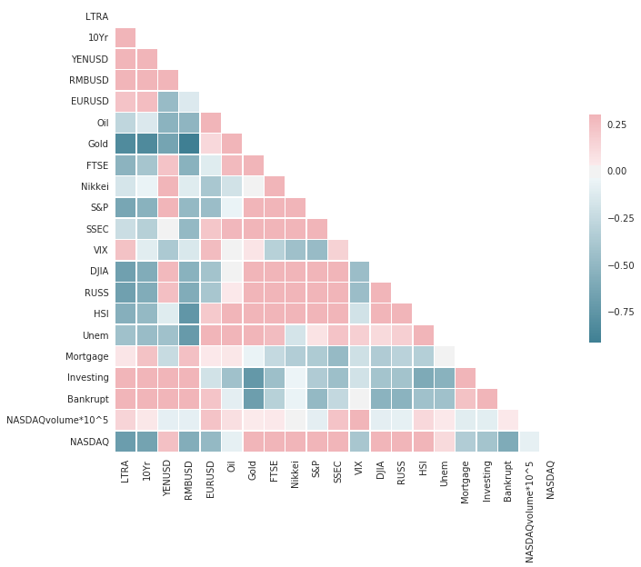

We can see that stock indices are highly correlated, and not much of this happen between stock indices and commodity. Surprisingly, Google trend indices show significant high correlation with risk-free rates and exchange rates.

Then we want to show plots of features. In order to make the trend more clear, we seperate them into different plots based on their scales:

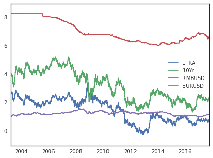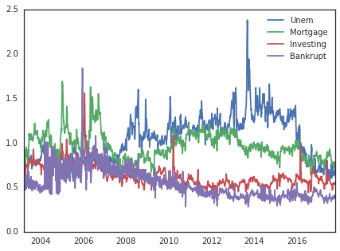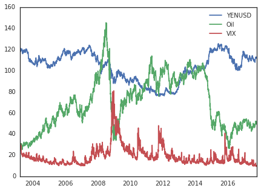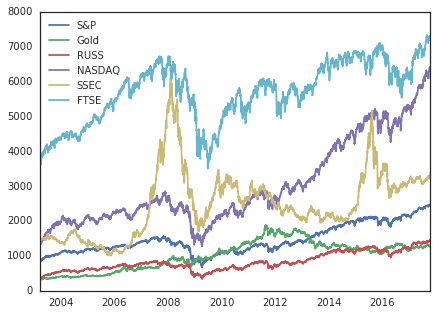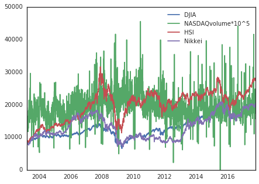

Then we calculate log return of NASDAQ 100 to do classification. The histogram of return is shown below:

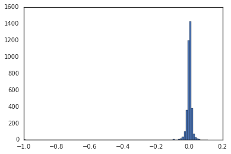

We discard some of the outliers in log returns (10 of them). The amended histogram looks like this:

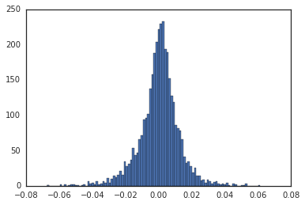

We can see NASDAQ 100 log return is nearly normally distributed.

Then we want to define our model as a binomial tree: while the log return is nonnegative, we mark them as up movement and define it as 1; otherwise, we define it as -1. We want to classfy whether today's NASDAQ Index is going up or down based on previous trading day's data.

## Preliminary Time Series analysis

Since the lognormal return of NASDAQ is a time series data, first we try to fit the data with a ARIMA model. The result is shown below:

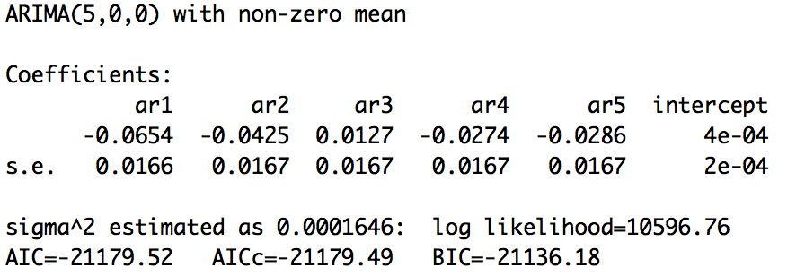

We can see the model fits an AR(5) model and the AIC value is really small. We then try to predict the latter 10 values and compare with the true values just for preliminary analysis. 

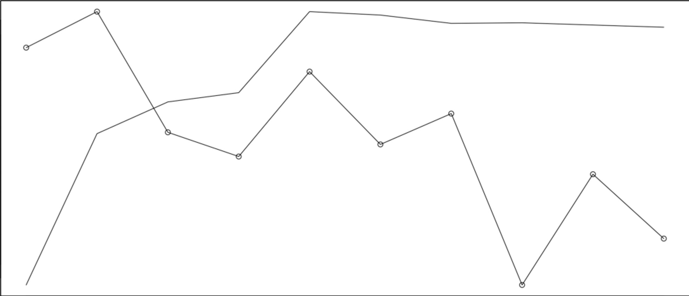

As line is the prediction, "o" line is the true value, the prediction is not well because the data does not show seasonal attribute and the data itself looks like a brownian motion. So time series prediction is not good in our case since the prediction just flattened out, which is even worse if we want to classify its trend instead of values.

## Preliminary analysis

We performed principal component analysis with respect to the features, and here is the result:

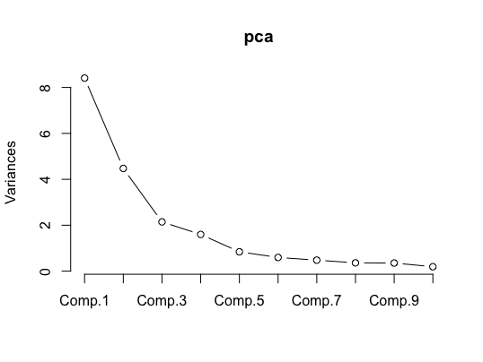

As a preliminary analysis, we built one nonlinear model (classification tree) and one linear model (linear logistics regression)to predict the next day's NASDAQ index change direction using features of the previous day.

We divided the dataset into training set (3000 samples) and testing set (617 samples)

### Nonlinear model - Classification Tree

We attempt to use classification tree to explore whether the features of previous day could predict the next day's NASDAQ index change direction. Here is the classification derived from training set.

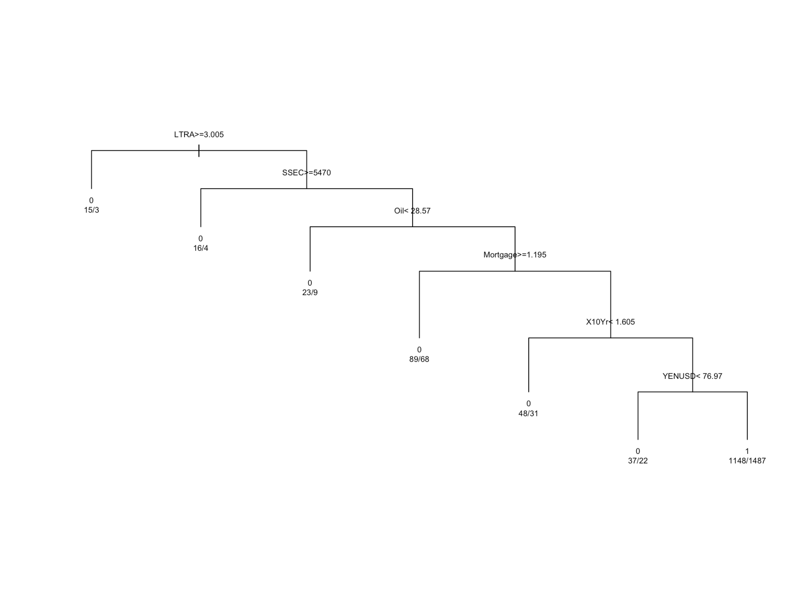

The in the sample error on training set is 42.83%, and the out of sample error on test set is 42.79%. The error is a bit high so our model is under fitting.

### Linear model - Linear Logistics Regression

In the linear logistics model, the data with larger scale may dominate the data with smaller scale when making prediction, so we first use standardize the training dataset and then use the standardization scaler of the training set to scale the testing set.

We use all 20 scaled features to train the linear logistics regression model without regularization in the training set and predict the index direction in the testing set using the testing sample. 

The result of the model shows that the prediction accuracy is 54.29%.

## Logistic Regression with L2 regularizer
From the correlation heapmap of features, we find that correlations between some features are very large, it may affect the coeffiencients and make them unreasonably large. So, we want to add the l2 (quadratic) regularizer in the loss function and use the 5-fold cross validation in the training set to find the best regularization parameter in our model.

The 5-fold cross validation shows that when  , the validation error is the smallest. Thus, we will use that regularization parameter to train the l2 regularized logistic regression, and test the model in the test set. 

The prediction accuracy in the test set is 56.08%, which improves by 2% from that of the logistic regression without regularization.

## Support Vector Machines 
We further try the SVM model without kerel to make predictions. In fact, SVM model uses the hinge loss function with the quadratic regularizer. We train the model in the training set and make predictions in the test set. The prediciton accuracy in the test set is 55.11%. Compared to the logistic regression model, the SVM model has a similar prediction effect.

## Feature Selecion and Linear Regression
Because there are 22 feature in row data, so we can select features to reduce the number of feature and find if the feature selection could help the prediction.

We can use LASSO to predict the next day's log return, and change the alpha of LASSO to see the selection of feature.

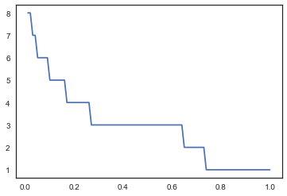

Obviously, even if alpha is very small, the number of feature would suddenly decrease to 8. We can check what feature it selected:

When alpha =  0.01 , features has ['Gold', 'Nikkei', 'SSEC', 'DJIA', 'RUSS', 'HSI', 'NASDAQvolume', 'NASDAQ']

When alpha =  0.5 , features has ['DJIA', 'HSI', 'NASDAQvolume']

When alpha =  1 , features has ['NASDAQvolume']

For the commodities, the Gold price is mouch more important than oil price to predict the return of the NASDAQ. And for index, DJIA and HSI are the two most important features.

Also, in LASSO to predict the return of NASDAQ, the NASDAQ volume is the most important feature, even more important than NASDAQ, which means when we predict the changes of next day's NASDAQ index, it would be better for us to consider the volume of NASDAQ instead of other factors.

Then, we can check the correlation of the selected features.

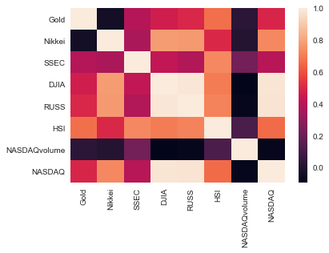

It seems the correlation matrix in selected features are not high.

SO, we can check the result of LASSO and ridge regression to see if the regularized linear regression is effective in time series:

For the LASSO, the rate of prediction is 0.539708265802269.

For ridge regression, the rate of prediction is 0.5089141004862237.

Actually, both of results are not good. So we can't use linear regression in time series problems.

## Logistic Regression and SVM Using Selected Features

We use the selected features from the Lasso features selection above to train our logistic regresssion and SVM model with quadratic regularization, use cross validation to find the regularization parameters, and predict whether NASDAQ goes up or down in the test set. The following table shows the prediction accuracy of different number of selected features.

| Prediction  Accuracy| Logistic Regression |   SVM  |
| ------------------- | ------------------- | ------ |
| 8 selected features |      54.94%         | 55.11% |
| 3 selected features |      55.11%         | 55.11% |
| 1 selected features |      55.11%         | 55.11% |

The results show that feature selection does not improve much on the prediction accuracy of different number of selected features. For Logistic Regression and SVM, if we use too little features, the prediction accuracy will remain the same.

## Logistic Regression and SVM Using Principal Components

In our preliminary analysis, we performed PCA on the features in the training set. In this part, we want to use PCA to reduce the dimension of our features and then use the principal components as our new features in the logistic and SVM model to predict movements of NASDAQ. In this way, we want to reduce the noise in the feature data as much as possible. 

As shown in the PCA, we select the first seven principal components, which explains the 91.63% variance of all the features, as our new features, and run the logistic regression and SVM with quadratic regularization. 

The result shows that the prediction accuracy of logistic regression and SVM are 55.60% and 55.11% respectively. Again, we cannot improve the prediction accuracy with principal components.

## Artificial Neural Network
We performed a two layer artificial neural network on a random training set of size 3000 and test the model on the remaining data. The training error is 44.8% and the test error is 45.70502%.

## K-means Clustering
We performed K-means Clustering with K=2 on the whole data set and get the following result.

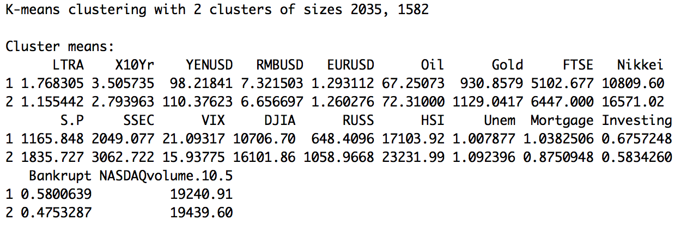

The Prediction error is 49.93%.

## Analysis of the Poor Performance of Classifiers

After using different classification algorithms to predict the movement of NASDAQ, we find that almost all the classifiers have poor prediction accuracy on the test set. Different feature engineering techniques cannot improve their performance. Therefore, we infer that the noise in the NASDAQ return is so large that these classification models are not able to find an obvious decision boundary between the up movement and down movement. We plot pictures of some feature pairs to visualize our inference.

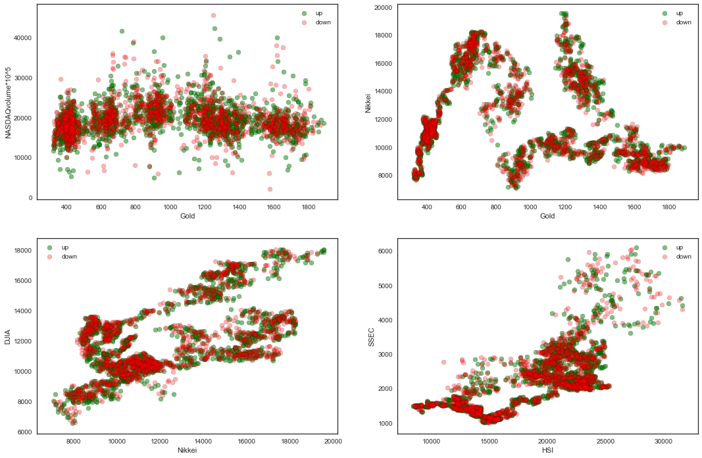

From these plots of feature pairs, we can observe that there are no obvious decision boundaries for "up" and "down" movement of NASDAQ in each feature pair. 

## Summary
In NASDAQ index prediction, we used data including daily data of Long Term Treasury Rate, 10 Year Treasury Bill Rate, USD/YEN, USD/RMB, USD/EUR, Oil Price, Gold Price, FTSE 100 Index, Nikkei 225 Index, S&P 500 Index, SSEC Index, VIX Index, Dow Jone Industrial Average, Russell 2000 Index, Hang Seng Index, Unemployment Google Trend Index, Mortgage Google Trend Index, Investing Google Trend Index, Bankrupcy Google Trend Index, NASDAQ Volume, and NASDAQ Index from 3/19/03 to 10/17/17, and fill the null with the average of non-null values to fix messy data. We want to use linear regression, classification and time series analysis to find the relationship between features and NASDAQ index.

In the preliminary analysis, we firstly analyze the relationship between features by using correlation matrix and plot. Then we applied ARIMA, but it is not good in our case since the prediction just flattened out, which is even worse if we want to classify its trend instead of values. And we also applied classification tree and linear regression to predict the next day's change of NASDAQ index. While we still can't get a good result.

After the midterm, we came up with the idea that the model could have too many features, and we can select the features in order to improve the performance. Then we applied LASSO and find the changes of feature. However, the NASDAQ index doesn't linearly depend on the features, for any type of linear regression couldn't get a good result. And when we use the selected features or principal components with SVM and logistic regression, the result can't be improved. So we can reject that the assumption that NASDAQ index has linear relationships with other index or commodity price.

At last, we analyzed the reason for poor performance.

## End of the Story
After nearly one month's work, our team handed Frank and Mike our product. They stared at it and of course not pleased by the result. Frank yelled, "Why?! I thought we are going to be living in Malibu and drinking lemonade forever without working!"
Suddenly, their boss showed up, "You two lazy workers! I already knew this result because the market is expected to weak form efficient. If you are going to make a 90% prediction based on historical indices, you can be my boss now! Now get back to work before I fire you!"

Nonetheless, it is a good start. With modifications of features and more economic research, beating the market may not be impossible.

## References

Robert H. Shumway, David S. Stoffer. (2011). Time Series Analysis and Its Applications: With R Examples, 3rd ed. 

Yaser S. Abu-Mostafa, Malik Magdon-Ismail, Hsuan-Tien Lin. (2012). Learning From Data.

M. Udell. (2017). Learning with Big Messy Data class notes. 
