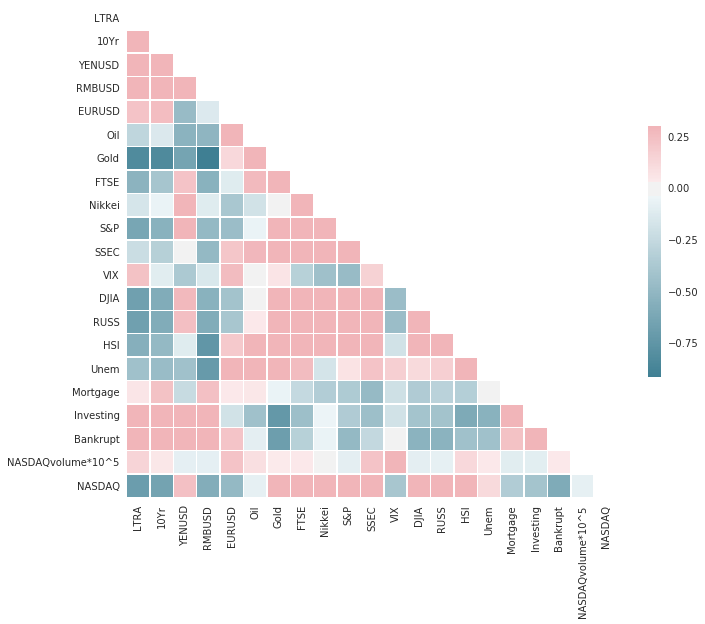
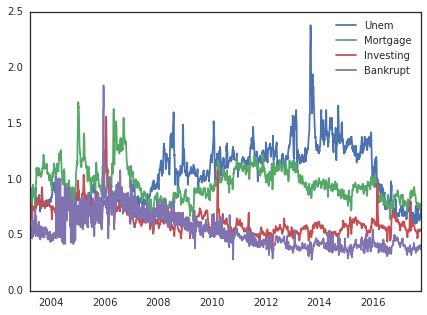
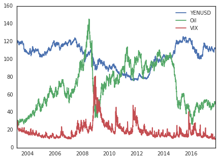
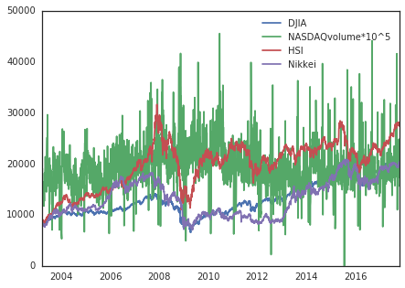

## Introduction

Frank and Mike are day traders in XYZ Company. One day after the stock market closed, Frank felt extremely tired and was sick of all the time and work he needed to put into this job by just staring at multiple trading screens and performing routine trades. So he came up to Mike and said, "Wouldn't it be cool if we can find out the trend of NASDAQ 100 automatically and just do trades on that? We don't need to stare at the screens anymore!" Mike said, "You know what? That is an interesting idea. I know some students at Cornell might be able to do this. Let me talk to them and see if they can realize your idea." So here we are, helping these two lazy employees.

First of all, what NASDAQ 100 is? It is a stock market index that is made up of 100 non-financial companies' securities which are listed on NASDAQ. Generally, its trend represents the situation of U.S's economy. In order to predict its trend, we need to find data that might capture NASDAQ's movement, and build a model to optimize the accuracy.

## Data set description

### Summary

Our data set include daily data of Long Term Treasury Rate,	10 Year Treasury Bill Rate, USD/YEN, USD/RMB, USD/EUR, Oil Price, Gold Price, FTSE 100 Index, Nikkei 225 Index, S&P 500 Index, SSEC Index, VIX Index, Dow Jone Industrial Average, Russell 2000 Index, Hang Seng Index, Unemployment Google Trend Index, Mortgage Google Trend Index, Investing Google Trend Index, Bankrupcy Google Trend Index, NASDAQ Volume, and NASDAQ Index from 3/19/03 to 10/17/17.

### Reasons For Choosing These Data

1. Risk-free rate that represent the trend of macroeconomy: Long Term Treasury Rate,	10 Year Treasury Bill Rate
2. Exchange rates that represent international trade and its stability: USD/YEN, USD/RMB, USD/EUR
3. Commodity prices that represent industrial development and global risk measure: Oil Price, Gold Price
4. Different Indices that represent different countries and districts' economy: FTSE 100 Index, Nikkei 225 Index, S&P 500 Index,  SSEC Index, VIX Index, Dow Jone Industrial Average, Russell 2000 Index, Hang Seng Index, NASDAQ Volume
5. Different Topics' Google Trend Data that represent people's emotions and concerns towards these topics: Unemployment Google Trend Index, Mortgage Google Trend Index, Investing Google Trend Index, Bankruptcy Google Trend Index

You can see that our data look like a structured portfolio, and we think that features in this portfolio might impact NASDAQ Index in different ways. 

### Messy Data Problem
1. There are some null values in data column Nikkei, Hang Seng, and SSEC. We decided to use the average of non-null values which days are before and after the null values' days, to fill these missing values.
2. Google Trend Data are continuous so they will include non-trading days, we also manage to delete those non-trading days' values to maintain consistency.

There are 20 features and 3618 examples for each feature.

## Features Analysis

Here is the heatmap of our features' correlation:

We can see that stock indices are highly correlated, and not much of this happen between stock indices and commodity. Surprisingly, Google trend indices show significant high correlation with risk-free rates and exchange rates.

Then we want to show plots of features. In order to make the trend more clear, we seperate them into different plots based on their scales:

Then we calculate log return of NASDAQ 100 to do classification. The histogram of return is shown below:

We discard some of the outliers in log returns (10 of them). The amended histogram looks like this:

We can see NASDAQ 100 log return is nearly normally distributed.

Then we want to define our model as a binomial tree: while the log return is nonnegative, we mark them as up movement and define it as 1; otherwise, we define it as -1. We want to classfy whether today's NASDAQ Index is going up or down based on previous trading day's data.

## Preliminary analysis

We performed principal component analysis with respect to the features, and here is the result:

As a preliminary analysis, we built one nonlinear model (classification tree) and one linear model (linear logistics regression)to predict the next day's NASDAQ index change direction using features of the previous day.

We divided the dataset into training set (3000 samples) and testing set (617 samples)

### Nonlinear model - Classification Tree

We attempt to use classification tree to explore whether the features of previous day could predict the next day's NASDAQ index change direction. Here is the classification derived from training set.

The in the sample error on training set is 42.83%, and the out of sample error on test set is 42.79%. The error is a bit high so our model is under fitting.

### Linear model - Linear Logistics Regression

In the linear logistics model, the data with larger scale may dominate the data with smaller scale when making prediction, so we first use standardize the training dataset and then use the standardization scaler of the training set to scale the testing set.

We use all 20 scaled features to train the linear logistics regression model without regularization in the training set and predict the index direction in the testing set using the testing sample. 

The result of the model shows that the prediction accuracy is 54.29%.

## Future Development

We can see that the prediction accuracy is mediocre. However, it is still pretty good since we are betting against the market, which many experts say its movement is close to brownian motion. In the next stage of developing our model, we want to do the following adjustment:
1. Shorten the period since data from remote period might cancel out recent data's significance
2. Use PCA to lower the dimensions, then apply sparse PCA and compare the errors
3. Find more ways to develop our tree model to avoid underfitting and overfitting
3. Try SVM and compare it with our current classification models
4. Use cross validation to find the optimal model
5. Maybe try to search for more features.
